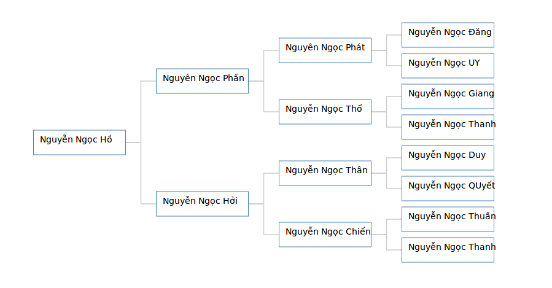
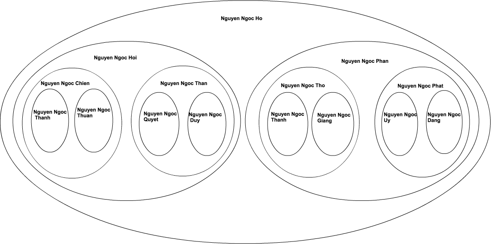
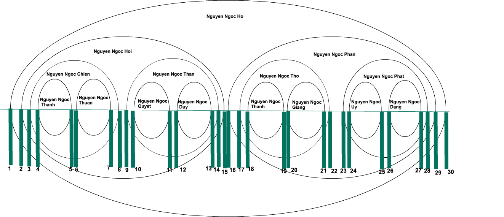

Gần đây mình có làm một dự án có liên quan đến lưu trữ dự liệu dạng phân cấp cha con. Đây là bài toán mình từng được học và dùng trong các bài thi ở trường đại học khá nhiều nhưng là lần đầu tiên mình sử dụng khi làm một dự án thực tế =]] Vậy để ôn lại chút kỉ niệm thời sinh viên, bài viết này sẽ tìm hiểu về dữ liệu dạng phân cấp (hierarchical data structure) và áp dụng bài toán với ROR.

## Table of contents
- Phần 1
  - [Giới thiệu](#introduce)
  - [Các cách cài đặt](#setup)
    - [Parent-child model (adjacency list model)](#parent_child)
    - [Nested set model (Mô hình tập hợp lồng nhau)](#nested_set_model)
  - [References](#references)
  - [Tổng kết](#summary)
- Phần 2
  - Đặt vấn đề
  - Gem awesome_nested_set
  - Vẽ cây phả hệ

# Giới thiệu {#introduce}
  Dự liệu dạng phân cấp là một tập hợp các dữ liệu mà mỗi phần tử có một phần tử cha `parent` hoặc có nhiều phần tử con `child` (ngoại trừ phần tử gốc `root` sẽ không có `parent`).

  Việc lưu trữ dữ liệu này được áp dụng nhiều trong các bài toán như phân cấp menu, category...
  Chúng ta sẽ tham khảo cấu trúc cha con phía dưới để làm ví dụ cho toàn bài viết.

  

# Các cách cài đặt {#setup}
  Việc lưu trữ dự liệu này trên CSDL cũng cần có sự tính toán. Dựa vào từng trường hợp mà ta có cách lưu trữ khác nhau. Hiện có 2 mô hình lưu trữ phổ biến là Nested set model (Mô hình tập hợp lồng nhau) và Parent-child model (mô hình cha con).

## Parent-child model {#parent_child}
  Trong cấu trúc này thì mỗi một node sẽ có 1 thuộc tính là parent_id dùng để lưu id của node cha của nó. Riêng node đầu tiên (root) sẽ có parent_id là null.

  Tạo database vs dữ liệu dựa trên mô hình ở trên.

  ```
  $ mysql -u root -p
  mysql> create database family_tree;
  mysql> use family_tree;
  mysql> CREATE TABLE families(id INT AUTO_INCREMENT PRIMARY KEY, name VARCHAR(50) NOT NULL,parent_id INT DEFAULT NULL);
  mysql> INSERT INTO families (name, parent_id) VALUES ("Nguyen Ngoc Ho", NULL), ("Nguyen Ngoc Hoi", 1), ("Nguyen Ngoc Chien", 2), ("Nguyen Ngoc Thanh", 3), ("Nguyen Ngoc Thuan", 3), ("Nguyen Ngoc Than", 2), ("Nguyen Ngoc QUyet", 6), ("Nguyen Ngoc Duy", 6), ("Nguyen Ngoc Phan", 1), ("Nguyen Ngoc Tho", 9), ("Nguyen Ngoc Thanh", 10), ("Nguyen Ngoc Giang", 10), ("Nguyen Ngoc Phat", 9), ("Nguyen Ngoc UY", 13), ("Nguyen Ngoc Dang", 13);
  mysql> Select * from families;
  +----+-------------------+-----------+
  | id | name              | parent_id |
  +----+-------------------+-----------+
  |  1 | Nguyen Ngoc Ho    |      NULL |
  |  2 | Nguyen Ngoc Hoi   |         1 |
  |  3 | Nguyen Ngoc Chien |         2 |
  |  4 | Nguyen Ngoc Thanh |         3 |
  |  5 | Nguyen Ngoc Thuan |         3 |
  |  6 | Nguyen Ngoc Than  |         2 |
  |  7 | Nguyen Ngoc QUyet |         6 |
  |  8 | Nguyen Ngoc Duy   |         6 |
  |  9 | Nguyen Ngoc Phan  |         1 |
  | 10 | Nguyen Ngoc Tho   |         9 |
  | 11 | Nguyen Ngoc Thanh |        10 |
  | 12 | Nguyen Ngoc Giang |        10 |
  | 13 | Nguyen Ngoc Phat  |         9 |
  | 14 | Nguyen Ngoc UY    |        13 |
  | 15 | Nguyen Ngoc Dang  |        13 |
  +----+-------------------+-----------+
  15 rows in set (0,00 sec)
  ```
  Như cách cài đặt ở trên `Nguyen Ngoc Ho` có  `parent_id` là  `NULL` vì nó là phần tử gốc(ông tổ của cây phả hệ trên). `Nguyen Ngoc Hoi` hay `Nguyen Ngoc Phan` đều có `parent_id` là 1, bởi vì bố của 2 ông này là `Nguyen Ngoc Ho` có `id` là 1. Tương đương như trên ta lưu được một cấu trúc cây dựa trên kiểu parent-child này vào CSDL.

  Với cách lưu như trên thì việc tìm node cha hay update, insert dữ liệu khá đơn giản. Nhưng với các yêu cầu như duyêt toàn bộ cây hay duyêt một nhánh của cây thì nó khá là phức tạp.

  Ví dụ:

  **Duyệt toàn bộ cây**

  ```
  mysql> SELECT f1.name AS the_he_1, f2.name AS the_he_2, f3.name AS the_he_3, f4.name AS the_he_4 FROM families AS f1 LEFT JOIN families AS f2 ON f2.parent_id = f1.id LEFT JOIN families AS f3 ON f3.parent_id = f2.id LEFT JOIN families AS f4 ON f4.parent_id = f3.id WHERE f1.name = "Nguyen Ngoc Ho";
  +----------------+------------------+-------------------+-------------------+
  | the_he_1       | the_he_2         | the_he_3          | the_he_4          |
  +----------------+------------------+-------------------+-------------------+
  | Nguyen Ngoc Ho | Nguyen Ngoc Hoi  | Nguyen Ngoc Chien | Nguyen Ngoc Thanh |
  | Nguyen Ngoc Ho | Nguyen Ngoc Hoi  | Nguyen Ngoc Chien | Nguyen Ngoc Thuan |
  | Nguyen Ngoc Ho | Nguyen Ngoc Hoi  | Nguyen Ngoc Than  | Nguyen Ngoc QUyet |
  | Nguyen Ngoc Ho | Nguyen Ngoc Hoi  | Nguyen Ngoc Than  | Nguyen Ngoc Duy   |
  | Nguyen Ngoc Ho | Nguyen Ngoc Phan | Nguyen Ngoc Tho   | Nguyen Ngoc Thanh |
  | Nguyen Ngoc Ho | Nguyen Ngoc Phan | Nguyen Ngoc Tho   | Nguyen Ngoc Giang |
  | Nguyen Ngoc Ho | Nguyen Ngoc Phan | Nguyen Ngoc Phat  | Nguyen Ngoc UY    |
  | Nguyen Ngoc Ho | Nguyen Ngoc Phan | Nguyen Ngoc Phat  | Nguyen Ngoc Dang  |
  +----------------+------------------+-------------------+-------------------+
  8 rows in set (0,00 sec)
  ```

  **Tìm tất cả các nút lá trong cây (những nốt không có con)**

  ```
  mysql> SELECT f1.id, f1.name FROM families AS f1 LEFT JOIN families AS f2 ON f1.id = f2.parent_id WHERE f2.id IS NULL;
  +----+-------------------+
  | id | name              |
  +----+-------------------+
  |  4 | Nguyen Ngoc Thanh |
  |  5 | Nguyen Ngoc Thuan |
  |  7 | Nguyen Ngoc QUyet |
  |  8 | Nguyen Ngoc Duy   |
  | 11 | Nguyen Ngoc Thanh |
  | 12 | Nguyen Ngoc Giang |
  | 14 | Nguyen Ngoc UY    |
  | 15 | Nguyen Ngoc Dang  |
  +----+-------------------+
  8 rows in set (0,00 sec)
  ```

  **Duyệt một nhánh của cây**

  ```
  mysql> SELECT f1.name AS the_he_1, f2.name AS the_he_2, f3.name AS the_he_3, f4.name AS the_he_4 FROM families AS f1 LEFT JOIN families AS f2 ON f2.parent_id = f1.id LEFT JOIN families AS f3 ON f3.parent_id = f2.id LEFT JOIN families AS f4 ON f4.parent_id = f3.id WHERE f1.name = "Nguyen Ngoc Ho" AND f4.name = "Nguyen Ngoc Dang";
  +----------------+------------------+------------------+------------------+
  | the_he_1       | the_he_2         | the_he_3         | the_he_4         |
  +----------------+------------------+------------------+------------------+
  | Nguyen Ngoc Ho | Nguyen Ngoc Phan | Nguyen Ngoc Phat | Nguyen Ngoc Dang |
  +----------------+------------------+------------------+------------------+
  1 row in set (0,00 sec)
  ```

  Tổng kết lại ta có thể thấy `Parent-child model` có những ưu và nhược điểm sau:

  **Ưu điểm:**
  - Cấu trúc dữ liệu đơn giản
  - Tìm node cha, node con cách 1 cấp dễ dàng
  - Thêm, xóa, di chuyển node đơn giản

  **Nhược điểm:**
  - Việc duyệt cây, duyệt nhánh, hay tìm các node con node cha trên một cấp khá phức tạp.

## Nested set model {#nested_set_model}

  Nested set model là một kỹ thuat dùng để thể hiện các tập hợp lồng nhau trong CSDL, các node cha sẽ bao lấy các node con.

  

  Như hình trên ta có thể thấy ông "Nguyen Ngoc Ho" là người to nhất và bao trọn những người khác, tương tự các node khác sẽ phân cấp thep thứ tự từ ngoài vào trong.

  Vậy trong CSDL để có thể xác định được node nào là node cha của một node?

  

  Qua hình trên ta có thể thấy mỗi node được đánh số thứ tự từ trái qua phải, mỗi node được duyệt qua 2 lần (left và right). Ví dụ node `Nguyen Ngoc Thanh` có [left, right] là [4,5] sẽ là con của node `Nguyen Ngoc Chien` có [left, right] là [3,8], tiếp tục với các node khác ta đã có thể hình dung được cách lưu trữ CSDL của cấu trúc này.

  Để lưu cấu trúc trên ta lưu thêm 2 trường `lft` và `rgt` lưu thông tin cho mỗi node.

  ```
  mysql> CREATE TABLE nested_families (id INT AUTO_INCREMENT PRIMARY KEY, name VARCHAR(50) NOT NULL, lft INT NOT NULL, rgt INT NOT NULL);

  mysql> INSERT INTO nested_families (name, lft, rgt) VALUES ("Nguyen Ngoc Ho", 1, 30), ("Nguyen Ngoc Hoi", 2, 15), ("Nguyen Ngoc Chien", 3, 8), ("Nguyen Ngoc Thanh", 4, 5), ("Nguyen Ngoc Thuan", 6,7), ("Nguyen Ngoc Than", 9, 14), ("Nguyen Ngoc Quyet", 10, 11), ("Nguyen Ngoc Duy", 12, 13), ("Nguyen Ngoc Phan", 16, 29), ("Nguyen Ngoc Tho", 17, 22), ("Nguyen Ngoc Thanh", 18, 19), ("Nguyen Ngoc Giang", 20, 21), ("Nguyen Ngoc Phat", 23, 28), ("Nguyen Ngoc Uy", 24, 25), ("Nguyen Ngoc Dang", 26, 27);

  mysql> SELECT * FROM nested_families;
  +----+-------------------+-----+-----+
  | id | name              | lft | rgt |
  +----+-------------------+-----+-----+
  |  1 | Nguyen Ngoc Ho    |   1 |  30 |
  |  2 | Nguyen Ngoc Hoi   |   2 |  15 |
  |  3 | Nguyen Ngoc Chien |   3 |   8 |
  |  4 | Nguyen Ngoc Thanh |   4 |   5 |
  |  5 | Nguyen Ngoc Thuan |   6 |   7 |
  |  6 | Nguyen Ngoc Than  |   9 |  14 |
  |  7 | Nguyen Ngoc Quyet |  10 |  11 |
  |  8 | Nguyen Ngoc Duy   |  12 |  13 |
  |  9 | Nguyen Ngoc Phan  |  16 |  29 |
  | 10 | Nguyen Ngoc Tho   |  17 |  22 |
  | 11 | Nguyen Ngoc Thanh |  18 |  19 |
  | 12 | Nguyen Ngoc Giang |  20 |  21 |
  | 13 | Nguyen Ngoc Phat  |  23 |  28 |
  | 14 | Nguyen Ngoc Uy    |  24 |  25 |
  | 15 | Nguyen Ngoc Dang  |  26 |  27 |
  +----+-------------------+-----+-----+
  15 rows in set (0.00 sec)
  ```

  Qua truy vấn ở trên ta có thể thấy, giá trị `lft` luôn bé hơn `rgt`, Giá trị `lft` tăng dần theo mỗi phân cấp còn giá trị `rgt` thì ngược lại. Lưu trữ như cách trên khá thuận lợi cho việc truy vấn trích xuất thông tin. Ví dụ:

  **Duyệt toàn bộ các node con thuộc một node cha bất kì**

  Ta thấy các node con sẽ nằm trong node cha nên giá trị `lft` của các node con sẽ lớn hơn `lft` của node cha đấy, giá trị `rgt` thì ngược lại.
  ```
  mysql> SELECT * from nested_families WHERE lft >= 2 AND rgt <= 15;
  +----+-------------------+-----+-----+
  | id | name              | lft | rgt |
  +----+-------------------+-----+-----+
  |  2 | Nguyen Ngoc Hoi   |   2 |  15 |
  |  3 | Nguyen Ngoc Chien |   3 |   8 |
  |  4 | Nguyen Ngoc Thanh |   4 |   5 |
  |  5 | Nguyen Ngoc Thuan |   6 |   7 |
  |  6 | Nguyen Ngoc Than  |   9 |  14 |
  |  7 | Nguyen Ngoc Quyet |  10 |  11 |
  |  8 | Nguyen Ngoc Duy   |  12 |  13 |
  +----+-------------------+-----+-----+
  7 rows in set (0.00 sec)
  ```

  **Tìm tất cả các node lá**

  Ta thấy ở các node lá giá trị `rgt` = `lft` + 1

  ```
  mysql> SELECT * from nested_families WHERE rgt = lft + 1;
  +----+-------------------+-----+-----+
  | id | name              | lft | rgt |
  +----+-------------------+-----+-----+
  |  4 | Nguyen Ngoc Thanh |   4 |   5 |
  |  5 | Nguyen Ngoc Thuan |   6 |   7 |
  |  7 | Nguyen Ngoc Quyet |  10 |  11 |
  |  8 | Nguyen Ngoc Duy   |  12 |  13 |
  | 11 | Nguyen Ngoc Thanh |  18 |  19 |
  | 12 | Nguyen Ngoc Giang |  20 |  21 |
  | 14 | Nguyen Ngoc Uy    |  24 |  25 |
  | 15 | Nguyen Ngoc Dang  |  26 |  27 |
  +----+-------------------+-----+-----+
  8 rows in set (0.00 sec)
  ```

  **Duyêt một nhánh của cây**

  ```
  mysql> SELECT parent.name FROM nested_families AS node, nested_families AS parent WHERE node.lft BETWEEN parent.lft AND parent.rgt AND node.name = "Nguyen Ngoc Thuan";
  +-------------------+
  | name              |
  +-------------------+
  | Nguyen Ngoc Ho    |
  | Nguyen Ngoc Hoi   |
  | Nguyen Ngoc Chien |
  | Nguyen Ngoc Thuan |
  +-------------------+
  4 rows in set (0.00 sec)
  ```

  **Tìm độ sâu của các node**

  ```
  mysql> SELECT node.name, (COUNT(parent.name) - 1) AS depth FROM nested_families AS node, nested_families AS parent WHERE node.lft BETWEEN parent.lft AND parent.rgt GROUP BY node.id;
  +-------------------+-------+
  | name              | depth |
  +-------------------+-------+
  | Nguyen Ngoc Ho    |   0   |
  | Nguyen Ngoc Hoi   |   1   |
  | Nguyen Ngoc Chien |   2   |
  | Nguyen Ngoc Thanh |   3   |
  | Nguyen Ngoc Thuan |   3   |
  | Nguyen Ngoc Than  |   2   |
  | Nguyen Ngoc Quyet |   3   |
  | Nguyen Ngoc Duy   |   3   |
  | Nguyen Ngoc Phan  |   1   |
  | Nguyen Ngoc Tho   |   2   |
  | Nguyen Ngoc Thanh |   3   |
  | Nguyen Ngoc Giang |   3   |
  | Nguyen Ngoc Phat  |   2   |
  | Nguyen Ngoc Uy    |   3   |
  | Nguyen Ngoc Dang  |   3   |
  +----+----------------------+
  15 rows in set (0.00 sec)
  ```

  **Thêm một node vào cây**

  Để thêm một node mới vào cây, ta cần phải tạo ra khoảng trống trong cấu trúc hiện tại, và cộng 2 đơn vị vào tất cả các giá trị `lft`, `rgt` mà lớn hơn giá trị `lft` của node được chọn.

  Ví dụ ta thêm node `Nguyen Ngoc Hieu` là con của node `Nguyen Ngoc Duy`

  - B1: Xác định giá trị `lft` của node `Nguyen Ngoc Hieu`. Giá trị này sẽ bằng giá trị của `rgt` của node cha là node `Nguyen Ngoc Duy`.
  - B2: Cộng 2 đơn vi vào tất cả các nút có giá trị `lft`, `rgt` lớn hơn giá trị `lft` của node `Nguyen Ngoc Hieu`

  ```
  mysql> LOCK TABLE nested_families WRITE;
  mysql> SELECT @myRight := rgt FROM nested_families WHERE name = "Nguyen Ngoc Duy";
  mysql> UPDATE nested_families SET rgt = rgt + 2 WHERE rgt >= @myRight;
  mysql> UPDATE nested_families SET lft = lft + 2 WHERE lft >= @myRight;
  mysql> INSERT INTO nested_families (name, lft, rgt) VALUES ("Nguyen Ngoc Hieu", @myRight, @myRight + 1);
  mysql> UNLOCK TABLES;
  mysql> SELECT CONCAT( REPEAT( ' ', (COUNT(parent.name) - 1) ), node.name) AS name, node.lft, node.rgt FROM nested_families AS node, nested_families AS parent WHERE node.lft BETWEEN parent.lft AND parent.rgt GROUP BY node.id ORDER BY node.lft;
  +----------------------+-----+-----+
  | name                 | lft | rgt |
  +----------------------+-----+-----+
  | Nguyen Ngoc Ho       |   1 |  32 |
  |  Nguyen Ngoc Hoi     |   2 |  17 |
  |   Nguyen Ngoc Chien  |   3 |   8 |
  |    Nguyen Ngoc Thanh |   4 |   5 |
  |    Nguyen Ngoc Thuan |   6 |   7 |
  |   Nguyen Ngoc Than   |   9 |  16 |
  |    Nguyen Ngoc Quyet |  10 |  11 |
  |    Nguyen Ngoc Duy   |  12 |  15 |
  |     Nguyen Ngoc Hieu |  13 |  14 |
  |  Nguyen Ngoc Phan    |  18 |  31 |
  |   Nguyen Ngoc Tho    |  19 |  24 |
  |    Nguyen Ngoc Thanh |  20 |  21 |
  |    Nguyen Ngoc Giang |  22 |  23 |
  |   Nguyen Ngoc Phat   |  25 |  30 |
  |    Nguyen Ngoc Uy    |  26 |  27 |
  |    Nguyen Ngoc Dang  |  28 |  29 |
  +----------------------+-----+-----+
  16 rows in set (0.00 sec)
  ```

# References: {#references}
  - [http://mikehillyer.com/articles/managing-hierarchical-data-in-mysql/](http://mikehillyer.com/articles/managing-hierarchical-data-in-mysql/)
  - [Nested set model](https://en.wikipedia.org/wiki/Nested_set_model)
  - [Models for hierarchical data](https://www.slideshare.net/billkarwin/models-for-hierarchical-data)

# Tổng kết {#summary}

  Qua các ví dụ trên ta có thể thấy được mô hình `Nested Set Model` có ưu điểm là truy xuất dữ liệu nhanh, nhưng ngược lại việc update thông tin khá phức tạp không thích hợp cho nhưng ứng dụng có dữ liệu thay đổi thường xuyên. Vậy nên tuỳ vào bài toàn mà ta sẽ chọn một mô hình lưu trữ phù hợp.

  Ở phần tiếp theo, mình sẽ áp dụng vào bài toán thực tế là xây dựng một cây gia phả với ROR, có sử dụng một số công nghệ như gem [awesome_nested_set](https://github.com/collectiveidea/awesome_nested_set) để xây dựng mô hình nested set model trong ROR và dùng [D3](https://d3js.org/) để vẽ một cây gia phả.


