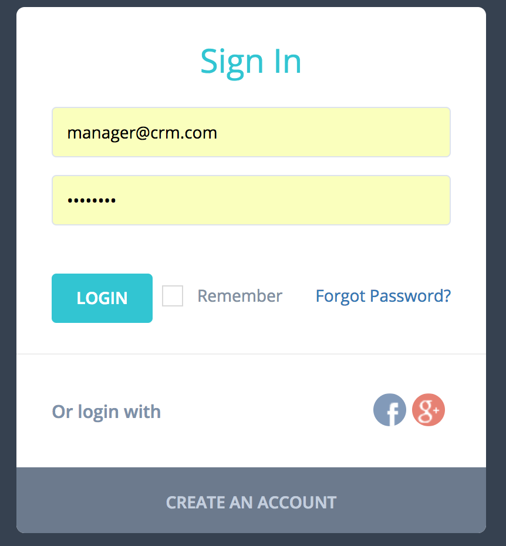

Hôm nay mình có gặp một vấn đề khá khó chịu khi làm form đăng kí, login cho một project linh tinh là việc trên trình duyệt như Chrome, Firefox tự động fill giá trị vào các ô input như email hay password kiểu dư lày



Cái này nó lấy thông tin tài khoản từ các trang khác mà mình có lưu trên trình duyệt để rồi tự động fill vào. Cá nhân thì mình thấy nó chả tiện dụng gì cả, mình cũng ít khi lưu thông tin tài khoản trên trình duyệt, ngoại lệ một số trường hợp như trên thì nguy hiểm vãi, chỉ cần `F12` sửa kiểu input password từ `password` sang `text` là password của bạn đã hiện ra. Xong phim!!! :skull:

Vậy làm thế nào để disable nó đi. Bình thường mình hay thêm `autocomplete="false"` vào ô input, nhưng cái này chỉ có tác dụng là tắt các chức năng gợi ý khi bạn nhập. Tìm hiểu thì thấy khá nhiều người gặp vấn đề này. Trên [stackoverflow](http://stackoverflow.com/questions/15738259/disabling-chrome-autofill) có một cách làm chuyển `autocomplete="new-password"`. Mình đã thử và thành công trên Chrome v.56, tuy là vẫn còn chút băn khoăn nhưng có vẻ là câu trả lời khả dĩ nhất.

```
<input type="email" name="email">
<input type="password" name="password" autocomplete="new-password">
```
Còn một số cách khác nữa như dùng js hay css để custom lại, trên trình duyệt hình như có chỗ để tắt cái này, cơ mà để ko phụ thuộc vào việc chỉnh sửa cài đặt trên trình duyệt thì theo mình có thể tự động disable nó trên website của mình vẫn tốt hơn.
