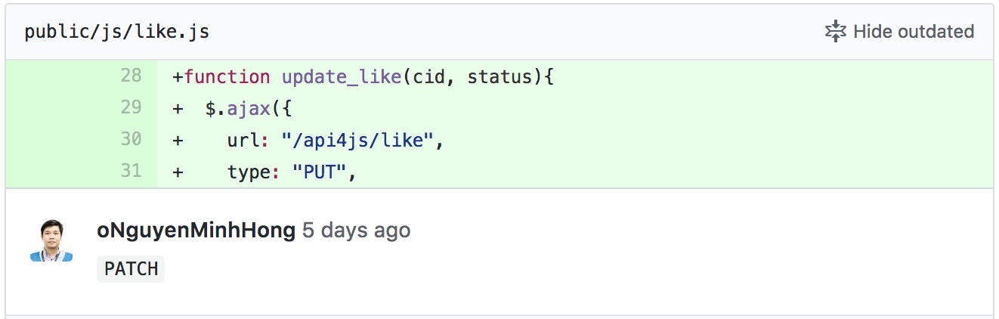

Gần đây mình có viết một đoạn ajax dùng method `PUT` để gủi request lên controller update một trường nào đó thì bị comment yêu cầu dùng method `PATCH`

Lâu nay code thì mình không để ý vấn đề này lắm vì cả hai đều gọi đến `update` trong controller.
Theo mình hiểu một cách đơn giản thì:

- `PUT` (UPDATE): Cập nhật thông tin cho Resource.
- `PATCH` (UPDATE): Cập nhật một thành phần, thuộc tính của Resource.

Bây giờ xem xét lại với ứng dụng của mình thì sẽ nên dùng cái nào. Bình thường ở các `form edit` của một ứng dụng `ROR` nào đấy chúng ta có bao giờ sẽ thay thế hoàn toàn một resource? Gần như là không bao giờ, thường thì những trường như `created_at` và `updated_at` `timestamps` không  được gán bởi người dùng cuối. Vậy `PATCH` nên được sử dụng trong trường hợp này.

Phần tìm hiểu trên được viết theo cách hiểu của người viết và dựa trên tài liệu:
- [Edge Rails: PATCH is the new primary HTTP method for updates](http://weblog.rubyonrails.org/2012/2/26/edge-rails-patch-is-the-new-primary-http-method-for-updates/)
