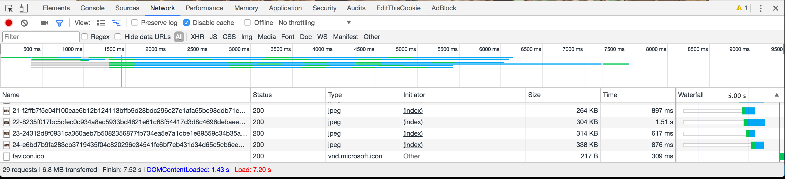
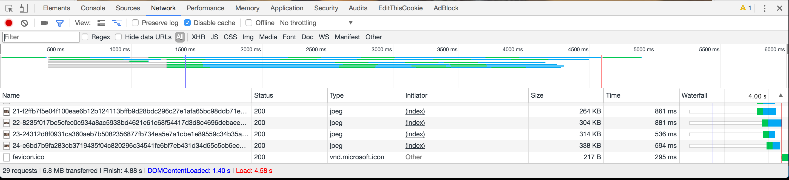

Việc tối ưu tốc độ tải trang luôn được ưu tiên hàng đầu trong việc phát triển web. Với những trang có chứa nhiều hình ảnh thì tốc độ load image ảnh hưởng khá nhiều đến trải nghiệm của người dùng.

Có khá nhiều cách để cải thiện vấn đề này như:

  - Sử dụng Browser caching
  - DÙNG CDN
  - Nén ảnh trên web
  - ...

Progressive Image là một trong số đó. Nếu các bạn để ý thì các trang như `medium`, `facebook` đều sử dụng phương pháp này, tức là ban đầu nó sẽ hiển thị toàn bộ hình trong khi chỉ tải một phần của dữ liệu, nghĩa là nó có thể bị vỡ trước khi tải hoàn tất. Ví dụ kiểu như thế này.

- Theo cách truyền thống thì sẽ load từ trên xuống dưới

  

- Theo progressive image nó sẽ hiện một cái ảnh mờ trước.
  

Rõ ràng ta có thể thấy progressive image giúp người dùng cảm nhận ảnh tốt hơn.

Về măt tốc độ thì dùng progressive image load nhanh hơn khá nhiều so với kiểu load cũ.

Để kiểm tra thì t sẽ dùng cả 2 cách để load lên 24 ảnh có độ phân giải cũng khá cáo

- Trường hợp ko dùng progressive image ([https://test-page-performance.herokuapp.com/](https://test-page-performance.herokuapp.com/))

  

- Trường hợp dùng progressive image ([https://test-page-performance.herokuapp.com/images/progressive_load](https://test-page-performance.herokuapp.com/images/progressive_load))

  

=]] tốc độ đã được cải thiện đáng kể.

Vậy để thực hiện một progressive image một cách đơn giản ta cần thực hiện theo từng bước sau

  1. Show empty place holder

  2. Thay thế nó bằng một ảnh chất lượng thấp kiểu như blurry image

  3. Cuối cùng sẽ thay thế bằng ảnh gốc chát lượng ban đàu.

Mọi người có thê xem demo dùng progressive image tại [đây](https://test-page-performance.herokuapp.com/). Hoặc source được viết bằng `Ruby on Rails` 

  - [https://github.com/oNguyenNgocTrung/test_page_performance](https://github.com/oNguyenNgocTrung/test_page_performance)
