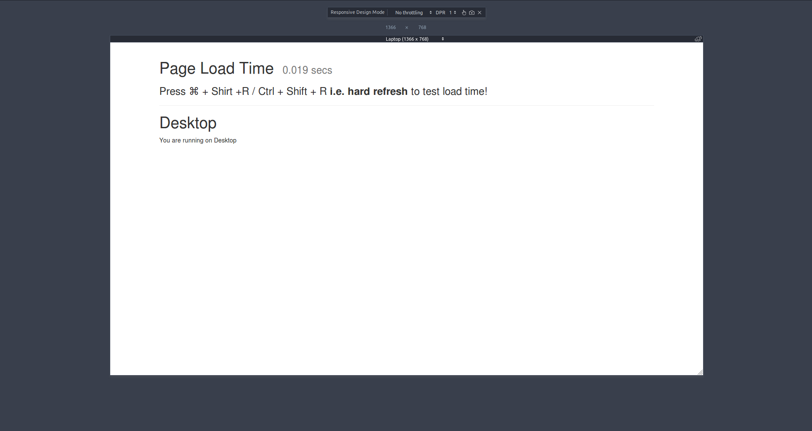
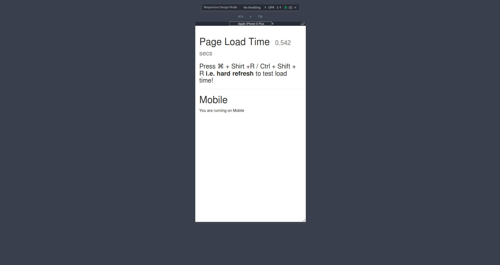
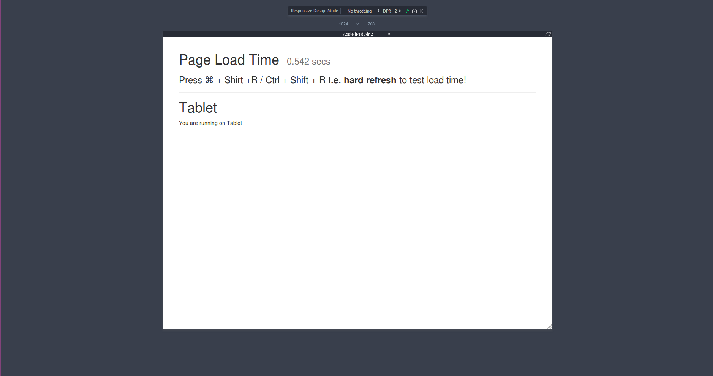

Trong bản phát hành Rails 4.1 có xuất hiện thêm một chức năng khá hay là [Action Pack Variants](http://guides.rubyonrails.org/4_1_release_notes.html#action-pack-variants). Chức năng này khá hữu ích khi làm responsive. Thay vì bạn phải sử dụng `CSS`, `JavaScript` để giúp website hiện thị phù hợp trên từng thiết bị, đặc biệt với những trang phức tạp hơn thì khối lượng `CSS`, `JavaScript` sẽ càng nhiều hơn gây nên chậm hơn thì với `Action Pack Variants` ta có thêm một options để giải quyết vấn đề này.
`Action Pack Variants` sẽ phát hiện được thiết bị bạn đang dùng để tải trang là gì và quyết định sẽ gửi những gì đến browser.

Vậy để sử dụng `Action Pack Variants` ta cần làm những gì?

Đầu tiên tạo một controller sẽ dùng Action Pack Variants

```ruby
  rails g controller TestVariants index
```
Thêm trong file `routes.rb`

```ruby
  Rails.application.routes.draw do
    #...
    resources :test_variants, only: [:index]
    #...
  end
```

Tiếp theo để Action Pack Variants hoạt động cần sử dùng một `before_action` trong application controller. Mở file `application_controller.rb` và thêm một số phần như sau.

```ruby
class ApplicationController < ActionController::Base
  #...
  before_action :detect_browser
  #...

  private
  #...
  def mobile?
    iphone = request.user_agent =~ /iPhone/
    ipod_touch = request.user_agent =~ /iPod touch/
    ipad = request.user_agent =~ /iPad/
    android = request.user_agent =~ /Android/
    android_tablet = request.user_agent =~ Regexp.union(/(?!Android.+Mobile)Android/, /Android.+SC-01C/)
    (iphone || ipod_touch || android) && !ipad && !android_tablet
  end

  def tablet?
    ipad = request.user_agent =~ /iPad/
    android_tablet = request.user_agent =~ Regexp.union(/(?!Android.+Mobile)Android/, /Android.+SC-01C/)
    ipad || android_tablet
  end

  def detect_browser
    request.variant = case true
                      when mobile?
                        :mobile
                      when tablet?
                        :tablet
                      else
                        :desktop
                      end
  end
  #...
end
```

Trước khi các action được gọi thì `detect_browser` sẽ được gọi trước để set giá trị cho `request.variant` theo ý bạn muốn. Như trên thì sẽ xác định được khi nào người dùng sử dụng thiết bị là `mobile`, `tablet` hay `desktop`.

Tiếp theo sẽ tạo từng view tương ứng cho từng loại thiết bị là `index.html.slim`, `index.html+mobile.slim`, `index.html+tablet.slim`. Ở đây tôi dùng `slim` cho ví dụ của mình các bạn có thể dùng `erb` hay `haml` thì cũng theo format như trên. Mặc định thì sẽ render ra file `index.html.slim` như ví dụ này để mặc định cho `desktop`.

```ruby
#index.html.slim

h1 = "Desktop"
p = "You are running on Desktop"
```

```ruby
#index.html+mobile.slim

h1 = "Mobile"
p = "You are running on Mobile"
```

```ruby
#index.html+tablet.slim

h1 = "Tablet"
p = "You are running on Tablet"
```

Vậy là đã xong phần thiết lập. Bạn có thể test trên từng thiết bị khác nhau để xem kết quả hoặc dùng `Chrome`, `Firefox` or bất cứ trình duyệt nào có hỗ trợ xem theo nhiều platform khác nhau.

- Trên desktop

  

- Trên mobile

  

- Trên tablet

  


Ngoài việc sử dụng variant cho responsive chúng ta có thể sử dụng nhiều cho mục đích khác tùy vào việc chúng ta gán giá trị cho variant vào việc gì, ví dụ như có thể dùng cho việc xem các phiên bản khác nhau, hay tùy vào `current_user` là `admin` hay `normal` thì phần view hiển thị có thể khác nhau...có rất nhiều bài toán có thể áp dụng.

Source code phần demo ở [đây](https://github.com/oNguyenNgocTrung/test_page_performance/commit/5cef12a10dbada15f8b119ba0f0da71c0ac5e9af)


