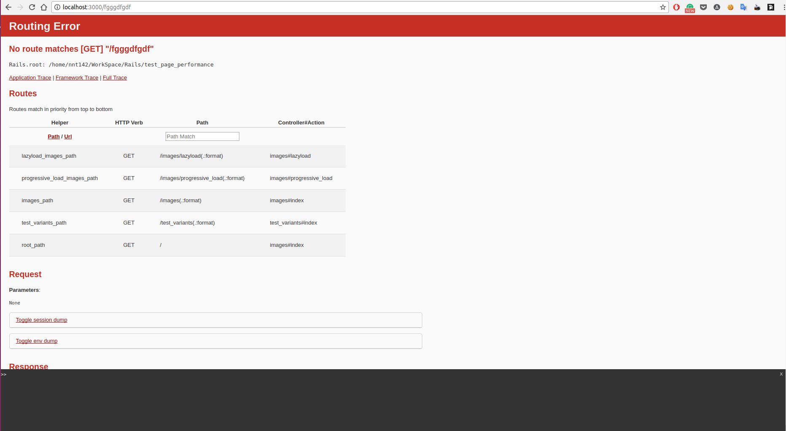
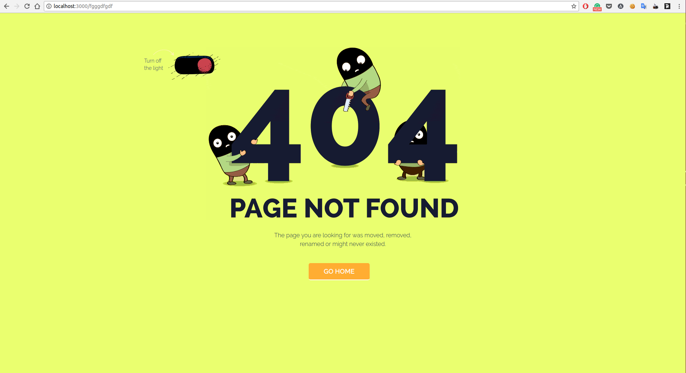

Có một yêu cầu cơ bản mà hầu hết khi phát triển website ít chú ý đến hoặc hầu như quên đi là "Trang thông báo lỗi `Page not found` hoặc lỗi máy chủ `internal server error` hiển thị cho người dùng."

404 (Page not Found) và 500 (Internal Server Error) là những yêu tố cần thiết cho việc phát triển 1 web app. Khi làm việc với Rails, thay vì đưa ra trang thông báo 404 or 505 sẽ đưa ra các lỗi cụ thể để giúp cho việc debug. Vì vậy chúng ta thường quên đi mất phải custom lại thông báo này thay vì đưa ra những thông tin không cần thiết có thể gây ấn tượng không tốt cho người dùng cuối.



Vậy thay vì để hiện thị mặc định như trên chúng ta sẽ custom lại trang thông báo lỗi trông thân thiện với người dùng hơn.

**Bước 1:**

Thêm dòng sau vào file `config/application.rb` trước `end` :

```ruby
config.exceptions_app = self.routes
```
 Việc này mục đích để Rails cấu hình tất cả các ngoại lệ sẽ được handler bởi `routes`

**Bước 2:**

Mở file `config/environments/development.rb` và chuyển đổi dòng sau thành `false` :

```ruby
config.consider_all_requests_local = false
```

Bước này để môi trường development xem xét tất cả các yêu cầu đến máy chủ cục bộ là từ xa để ngăn chặn các trang lỗi sẽ render như bình thường(như hình ảnh ở trên). Khi muốn quay lại hiển thị như ban đầu bạn chỉ cần chuyển nó thành `true`

**Bước 3:**

Đến file `config/routes.rb` và thêm:

```ruby
match '/404', to: 'error/errors#not_found', via: :all
match '/500', to: 'error/errors#internal_server_error', via: :all
```

Ở đây trong trường hợp lỗi 404 hoặc 500, sẽ handle các lỗi với các action tương ứng trong controller `ErrorsController`

**Bước 4:**

Tạo file `app/controllers/error/errors_controller.rb`

```ruby
class Error::ErrorsController < ApplicationController
  # handle Page not Found
  def not_found
    return render_error_not_found
  end

  # handle Internal Server Error
  def internal_server_error
    return render_error_internal_server_error
  end

  protected

  def render_error_not_found
    respond_to do |format|
      format.html {render file: "#{Rails.root}/public/404.html"}
      format.json do
        render status: :not_found,
          json: {
            errors: ["Sorry the page you requested could not be found"]
          }
      end
    end
  end

  def render_error_internal_server_error
    respond_to do |format|
      format.html {render file: "#{Rails.root}/public/500.html"}
      format.json do
        render status: :internal_server_error,
          json: {
            errors: ["There was an internal server error. Please contact Admin"]
          }
        end
    end
  end
end
```

Trong controller này sẽ xử lí hầu hết các định dạng được sử dụng của Rails là: HTML và JSON. Nếu request format là html thì sẽ render file HTML tương ứng có trong thư mục `public` và 1 request api cho format json là 1 thông báo lỗi đơn giản như trên.

**Bước 5:**

Cuối cùng chúng ta sẽ thay đổi giao diện trang 404 và 500. Có khá nhiều mẫu mã đẹp cho các trang thông báo này trên mạng or bạn có thể DIY tùy ý. Ví dụ 1 trang 404 như sau.

Mở file `public/404.html`
```html
<!DOCTYPE html>
<!--[if lt IE 7 ]><html class="ie ie6" lang="en"> <![endif]-->
<!--[if IE 7 ]><html class="ie ie7" lang="en"> <![endif]-->
<!--[if IE 8 ]><html class="ie ie8" lang="en"> <![endif]-->
<!--[if (gte IE 9)|!(IE)]><!-->
<html lang="en"> <!--<![endif]-->

<head>
  <meta charset="utf-8" />
  <title>404</title>
  <meta name="author" content="pkfrom" />
  <meta name="keywords" content="404 page, css3, template, html5 template" />
  <meta name="description" content="404 - Page Template" />
  <meta name="viewport" content="width=device-width, initial-scale=1, maximum-scale=1" />
  <!-- Libs CSS -->
  <link type="text/css" media="all" href="https://maxcdn.bootstrapcdn.com/bootstrap/3.3.6/css/bootstrap.min.css" rel="stylesheet" />
  <link type="text/css" media="all" href="//pkfrom.github.io/404/assets/css/404.min.css" rel="stylesheet" />

  <!-- Favicons -->
  <link rel="apple-touch-icon" sizes="144x144" href="//pkfrom.github.io/404/assets/img/favicons/favicon144x144.png" />
  <link rel="apple-touch-icon" sizes="114x114" href="//pkfrom.github.io/404/assets/img/favicons/favicon114x114.png" />
  <link rel="apple-touch-icon" sizes="72x72" href="//pkfrom.github.io/404/assets/img/favicons/favicon72x72.png" />
  <link rel="apple-touch-icon" href="//pkfrom.github.io/404/assets/img/favicons/favicon57x57.png" />
  <link rel="shortcut icon" href="//pkfrom.github.io/404/assets/img/favicons/favicon.png" />
  <!-- Google Fonts -->
  <link href='http://fonts.googleapis.com/css?family=Raleway:300,400,500,600,700,800,900' rel='stylesheet' type='text/css'>

</head>
<body>

  <!-- Load page -->
  <div class="animationload">
    <div class="loader">
    </div>
  </div>
  <!-- End load page -->

  <!-- Content Wrapper -->
  <div id="wrapper">
    <div class="container">
      <!-- Switcher -->
      <div class="switcher">
        <input id="sw" type="checkbox" class="switcher-value">
        <label for="sw" class="sw_btn"></label>
        <div class="bg"></div>
        <div class="text">Turn <span class="text-l">off</span><span class="text-d">on</span><br />the light</div>
      </div>
      <!-- End Switcher -->

      <!-- Dark version -->
      <div id="dark" class="row text-center">
        <div class="info">
          
        </div>
      </div>
      <!-- End Dark version -->

      <!-- Light version -->
      <div id="light" class="row text-center">
        <!-- Info -->
        <div class="info">
          
          <!-- end Rabbit -->
          <p>The page you are looking for was moved, removed,<br />
          renamed or might never existed.</p>
          <a href="http://%domain%/" class="btn">Go Home</a>
          <!--<a href="#" class="btn btn-brown">Contact Us</a>-->
        </div>
        <!-- end Info -->
      </div>
      <!-- End Light version -->

    </div>
    <!-- end container -->
  </div>
  <!-- end Content Wrapper -->


  <!-- Scripts -->
  <script src="https://code.jquery.com/jquery-2.2.0.min.js" type="text/javascript"></script>
  <script src="https://maxcdn.bootstrapcdn.com/bootstrap/3.3.6/js/bootstrap.min.js" type="text/javascript"></script>
  <script src="//pkfrom.github.io/404/assets/js/modernizr.custom.js" type="text/javascript"></script>
  <script src="https://cdnjs.cloudflare.com/ajax/libs/jquery.nicescroll/3.6.0/jquery.nicescroll.min.js" type="text/javascript"></script>
  <script src="//pkfrom.github.io/404/assets/js/404.min.js" type="text/javascript"></script>

  <!-- HTML5 shim and Respond.js for IE8 support of HTML5 elements and media queries -->
    <!--[if lt IE 9]>
    <script src="https://oss.maxcdn.com/html5shiv/3.7.2/html5shiv.min.js"></script>
    <script src="https://oss.maxcdn.com/respond/1.4.2/respond.min.js"></script>
  <![endif]-->

</body>
</html>
```

Và đây là kết quả =]]



Đây là một cách cơ bản để tùy biến các thông báo lỗi, bạn có thể tham khảo source code tại [đây](https://github.com/oNguyenNgocTrung/test_page_performance/commit/485bc0301ff8ef770580401457283a81d26dc6f7)
