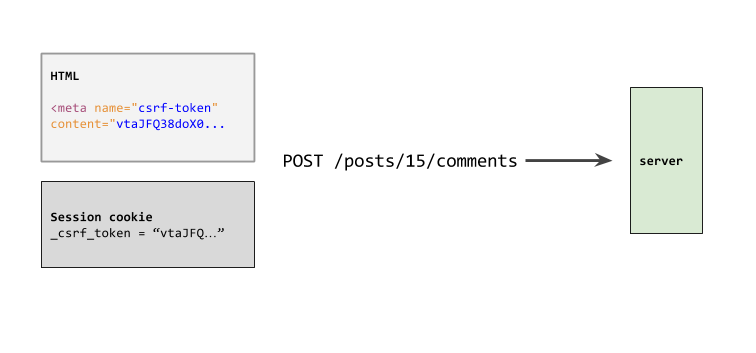
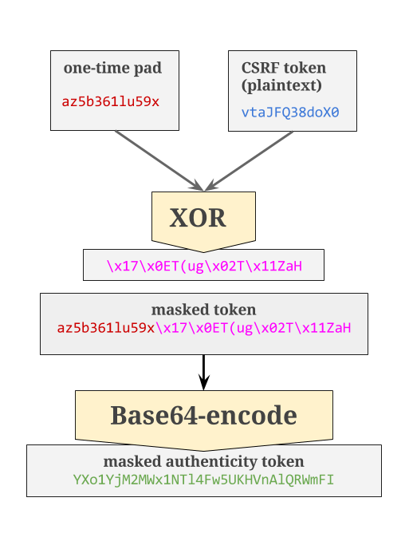

`CSRF` là một tính năng quan trọng trong Rails. Trong bài viết này chúng ta sẽ tìm hiểu chi tiết về cách hoạt động của nó. Bài viết được dịch và tóm tắt lại từ [đây](https://medium.com/rubyinside/a-deep-dive-into-csrf-protection-in-rails-19fa0a42c0ef) theo cách hiểu của người viết.

Cross-Site Request Forgery (CSRF) là một cách tấn công cho phép một người dùng cố tình giả mạo yêu cầu hợp pháp đến máy chủ của bạn, giả mạo như là một người dùng đã được chứng thực. Rails chống lại kiểu tấn công này bằng cách tạo ra các token duy nhất và xác nhận tính xác thực của chúng với mỗi lần gửi.

# The Basics

Có hai thành phần của CSRF. Đàu tiên là một `unique token` được nhúng trong HTML trang web của bạn. Token này cũng được lưu trữ trong sesion cookie. Khi một người dùng tạo một POST request thì CSRF token cũng sẽ được gửi lên cùng với request đó. Rails so sánh token được gửi lên với token được lưu ở session cookie để đảm bảo chúng giống nhau.



# How you use it

Là một Rails dev, về cơ bản bạn được dùng CSRF protection miễn phí. Nó bắt đầu với 1 dòng code đơn giản này trong `application_controller.rb`:

```ruby
protect_from_forgery with: :exception
```

Tiếp theo, thêm 1 dòng trong `application.html.erb`:

```ruby
<%= csrf_meta_tags %>
```

... và đó là cách chúng ta dùng CSRF. Điều này đã xảy ra trong Rails qua nhiều năm. Nhưng thực sự thì nó được hoạt động như thế nào?

# Generation and Encryption(Khởi tạo và mã hóa)

Chúng ta sẽ bắt đầu với `#csrf_meta_tags`. Nó là một simple view helper thực hiện công việc nhúng authencity token vào trong HTML:

```ruby
# actionview/lib/action_view/helpers/csrf_helper.rb

def csrf_meta_tags
  if protect_against_forgery?
    [
      tag("meta", name: "csrf-param", content: request_forgery_protection_token),
      tag("meta", name: "csrf-token", content: form_authenticity_token)
    ].join("\n").html_safe
  end
end
```

`csrf-token` tag là những gì chúng ta sẽ tập trung vào, vì đó là nơi mà tất cả điều kỳ diệu xảy ra. `#form_authenticity_token` được gọi để lấy actual token. Tại thời điểm này, chúng ta đã thử nhập module `RequestForgeryProtection` của `ActionController`. Giờ là lúc bắt đầu tìm hiểu về nó!

Module `RequestForgeryProtection` xử lý tất cả mọi thứ để làm việc với CSRF. Nổi bât nhất là method `#protect_from_forgery` mà chúng ta đã gọi ở trên trong `ApplicationController`, việc của nó là đảm bảo CSRF được kích hoạt trên mỗi request gọi đến và xử lí khi một request không được verified. Ngoài ra, nó cũng quan tâm đến việc sinh mã, mã hóa và giải mã CSRF token. Điểm hay của module này là nó chính là một scope nhỏ của rails. Ngoài sự trợ giúp của một số view helper thì bạn có thể thấy hầu như tất cả các tiến trình thực hiện việc bảo vệ trước tấn công CSRF ở ngay trong file này.

Tiếp tục đào sâu hơn về cách hoạt động của CSRF token trong HTML. `form_authenticity_token` là một method wrapper đơn giản có thể truyền bất kỳ tham số tùy chọn nào nhằm mục đích set giá trị token cho chính session, sử dụng `#masked_authenticity_token`

```ruby
# actionpack/lib/action_controller/metal/request_forgery_protection.rb

# Sets the token value for the current session.
def form_authenticity_token(form_options: {})
  masked_authenticity_token(session, form_options: form_options)
end

# Creates a masked version of the authenticity token that varies
# on each request. The masking is used to mitigate SSL attacks
# like BREACH.
def masked_authenticity_token(session, form_options: {}) # :doc:
  # ...
  raw_token = if per_form_csrf_tokens && action && method
    # ...
  else
    real_csrf_token(session)
  end

  one_time_pad = SecureRandom.random_bytes(AUTHENTICITY_TOKEN_LENGTH)
  encrypted_csrf_token = xor_byte_strings(one_time_pad, raw_token)
  masked_token = one_time_pad + encrypted_csrf_token
  Base64.strict_encode64(masked_token)
end
```

Kể từ khi giới thiệu [CSRF tokens cho mỗi biểu mẫu trong Rails 5](http://edgeguides.rubyonrails.org/upgrading_ruby_on_rails.html#per-form-csrf-tokens), method `#masked_authenticity_token` đã trở nên phức tạp hơn một chút. Trong đoạn tìm hiểu này, chúng ta sẽ tập trung vào việc implementation ban đầu, một CSRF token duy nhất cho mỗi request - một kết thúc trong `meta` tag. Trong trường hợp này, chúng chỉ có thể chỉ tập trung vào `else` trong câu điều kiện bên trên, kết thúc việc thiết lập `raw_token` thành giá trị trả về của `#real_csrf_token`.

Tại sao chúng ta phải đưa `session` vào method `#real_csrf_token?` Đó là bởi method này thực sự làm 2 điều: Tạo ra mẫu nguyên bản - token chưa được mã hóa và đưa token đó vào session cookie:

```ruby
# actionpack/lib/action_controller/metal/request_forgery_protection.rb

def real_csrf_token(session) # :doc:
  session[:_csrf_token] ||= SecureRandom.base64(AUTHENTICITY_TOKEN_LENGTH)
  Base64.strict_decode64(session[:_csrf_token])
end
```

Hãy nhớ rằng method này cuối cùng cũng được gọi bởi vì chúng ta đã gọi `#csrf_meta_tags` trong application layout. Đây là classic Rails Magic - một tác dụng phụ thông minh đảm bảo token trong session cookie sẽ luôn match với token ở page, bởi vì việc hiển thị token cho page không thể xảy ra mà không cần chèn thêm token đó vào cookie.

Anyway, chúng ta hãy nhìn vào dưới cùng của method `#masked_authenticity_token`:

```ruby
  one_time_pad = SecureRandom.random_bytes(AUTHENTICITY_TOKEN_LENGTH)
  encrypted_csrf_token = xor_byte_strings(one_time_pad, raw_token)
  masked_token = one_time_pad + encrypted_csrf_token
  Base64.strict_encode64(masked_token)
```

Sau khi đã chèn token vào session cookie, method này giờ đây sẽ liên quan đến việc trả lại token vào trong trang HTML và ở đây chúng ta sẽ có một số cách để phòng ngừa(chủ yếu để giảm thiểu khả năng tấn công bằng [SSL BREAK](https://github.com/rails/rails/pull/16570), mà ta sẽ không đi sâu vào đây). Lưu ý rằng chúng ta không mã hóa token để đưa vào session cookie, bởi vì từ Rails 4 thì thằng session cookie đã được mã hóa rồi.

Đầu tiên, chúng ta tạo ra một one-time pad sẽ sử dụng để  mã hóa raw token. [One-time pad](https://en.wikipedia.org/wiki/One-time_pad) là một kỹ thuật mã hoá dùng key được tạo ngẫu nhiên để mã hóa một message cơ bản với cùng độ dài và yêu cầu key được sử dụng để giải mã message. Nó được gọi là một `one-time` pad vì mỗi key chỉ được dùng cho 1 message và sau đó sẽ bị loại bỏ. Rails thực hiện điều này bằng cách tạo ra một `one-time pad` mới cho mỗi CSRF token mới, sau đó sử dụng nó để mã hóa token dùng `XOR bitwise`.



Khi thao tác này hoàn tất, chúng ta sẽ gửi masked authenticity token trở lại ngăn xếp, nơi nó kết thúc trong cách hiển thị application layout:

```ruby
<meta name="csrf-param" content="authenticity_token" />
<meta name="csrf-token" content="vtaJFQ38doX0b7wQpp0G3H7aUk9HZQni3jHET4yS8nSJRt85Tr6oH7nroQc01dM+C/dlDwt5xPff5LwyZcggeg==" />
```

# Decryption and verification(Giải mã và xác minh)

Chúng ta đã giới thiệu cách thức tạo ra CSRF token và làm thế nào để đưa vào HTML và cookie. Tiếp theo, chúng ta hãy nhìn vào cách Rails xác nhận một request đến.

Khi bạn submit một form từ site, CSRF token được gửi lên cùng với phần còn lại của form data(mặc định là param `authenticity_token`). Nó cũng có thể được gửi qua bởi `X-CSRF-Token` HTTP header.

Xem lại dòng này trong `ApplicationController` của chúng ta:

```ruby
protect_from_forgery with: :exception
```

Trong nhiều controller khác, method `#protect_from_forgery` này thêm vào trước mỗi action trong controller.

```ruby
before_action :verify_authenticity_token, options
```

Thao tác `before_action` này bắt đầu quá trình so sánh CSRF token trong request params hoặc header với token được lưu ở session cookie:

```ruby
# actionpack/lib/action_controller/metal/request_forgery_protection.rb

def verify_authenticity_token # :doc:
  #  ...
  if !verified_request?
    # handle errors ...
  end
end

# ...

def verified_request? # :doc:
  !protect_against_forgery? || request.get? || request.head? ||
    (valid_request_origin? && any_authenticity_token_valid?)
end
```

Sau khi thực hiện một số tác vụ quản trị(ví dụ: chúng ta không cần phải verify các requests HEAD hoặc GET), quá trình xác minh của chúng ta bắt đầu một cách nghiêm túc với `#any_authenticity_token_valid?`:

```ruby
def any_authenticity_token_valid? # :doc:
  request_authenticity_tokens.any? do |token|
    valid_authenticity_token?(session, token)
  end
end
```

Kể từ khi một request có thể  gửi token trong form params hoặc như là một header, Rails chỉ yêu cầu rằng ít nhất một trong số những token này trùng với token trong session cookie.

`#valid_authenticity_token?` là một method khá dài, nhưng cuối cùng nó chỉ làm ngược lại method `#masked_authenticity_token` để giải mã và so sánh token:

```ruby
def valid_authenticity_token?(session, encoded_masked_token) # :doc:
  # ...

  begin
    masked_token = Base64.strict_decode64(encoded_masked_token)
  rescue ArgumentError # encoded_masked_token is invalid Base64
    return false
  end

  if masked_token.length == AUTHENTICITY_TOKEN_LENGTH
    # ...

  elsif masked_token.length == AUTHENTICITY_TOKEN_LENGTH * 2
    csrf_token = unmask_token(masked_token)

    compare_with_real_token(csrf_token, session) ||
      valid_per_form_csrf_token?(csrf_token, session)
  else
    false # Token is malformed.
  end
end
```

Trước tiên, cần lấy chuỗi Base64-encoded và giải mã nó để  có được "masked token". Từ đây, có thể phát hiện ra token và sau đó so sánh nó với token được lưu ở session cookie:

```ruby
def unmask_token(masked_token) # :doc:
  one_time_pad = masked_token[0...AUTHENTICITY_TOKEN_LENGTH]
  encrypted_csrf_token = masked_token[AUTHENTICITY_TOKEN_LENGTH..-1]
  xor_byte_strings(one_time_pad, encrypted_csrf_token)
end
```

Trước khi `#unmask_token` có thể thực hiện cryptography magic cần thiết để giải mã token, chúng ta phải tách token được che dấu vào các phần cần thiết của nó: one-time pad và token được mã hóa. Sau đó, nó `XORs` 2 strings để cuối cùng tạo ra raw token ban đầu.

Cuối cùng, `#compare_with_real_token` dựa vào `ActiveSupport :: SecureUtils` để đảm bảo các token khớp với nhau:

```ruby
def compare_with_real_token(token, session) # :doc:
  ActiveSupport::SecurityUtils.secure_compare(token, real_csrf_token(session))
end
```

Và, cuối cùng, request đã đc authorized!
