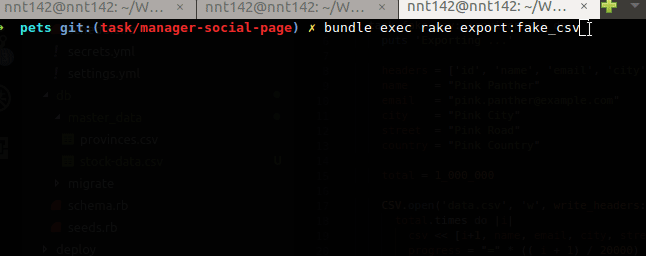
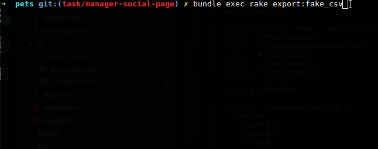
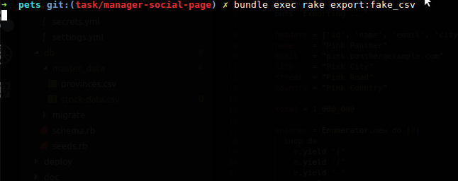

Trong Rails đôi khi chúng ta phải chạy các rake task trên rails console mất khá nhiều thời gian như việc import khoảng 100k dữ liệu chẳng hạn. Bình thường chúng ta chỉ hiện thông báo ví dụ như là "Importing..." hay "Import done." khá là nhàm chán khi chúng ta không biết được cụ thể tiến trình đã thực hiện được đến đâu rồi. Trong bài này mình sẽ tạo một thanh tiến trình progress để thông báo tượng tự như việc bạn download 1 file băng lệnh `wget` trên linux.


Ví dụ mình có 1 rake task export ra csv vs khoảng 1 triệu dòng.

```ruby
require "csv"

namespace :export do
  desc "Export fake csv"
  task fake_csv: :environment do
    puts 'Exporting ...'

    headers = ['id', 'name', 'email', 'city', 'street', 'country']
    name    = "Pink Panther"
    email   = "pink.panther@example.com"
    city    = "Pink City"
    street  = "Pink Road"
    country = "Pink Country"

    total = 1_000_000

    CSV.open('data.csv', 'w', write_headers: true, headers: headers) do |csv|
      total.times do |i|
        csv << [i+1, name, email, city, street, country]
      end
    end

    puts "\nExport done."
  end
end
```

Với đoạn code trên thì chúng ta có khoản 9->10s nhàm chán để chờ task chạy xong.


Để bớt nhàm chán khi chờ đợi ở trên thì ngoài cách ra ngoài uống trà lướt facebook thì ta có thể thêm thông báo tiến trình đang ở mức bao nhiêu %, tuy ko giúp ích được nhiều nhưng cũng đỡ hơn phần nào, kiểu bạn đi đường mà biết đích đến mình đã đi đc bao nhiêu % rồi vẫn tốt hơn việc đi mà ko biết mình đã đi đc bao nhiêu, bao lâu nữa thì đến =]]

Cách đầu tiên khá đơn giản là thêm cập nhật phần trăm khi chạy bằng lệnh `printf`

Thêm dòng code vào đoạn rake task trên

```ruby
...
total.times do |i|
  printf("\rPercentage: %d%", (i+1) * 100 / total)
  ...
end
....
```

Sau khi thực hiện thì ta có log hiển thị như sau:


Cách tiếp theo ta thêm 1 thanh progress hiển thị tiến trình chạy

Sửa lại đoạn rake task trên thành như sau

```ruby
...
total.times do |i|
  progress = "=" * (( i + 1) / 20000) unless (i + 1) < 20000
  printf("\rProgress: [%-50s]", progress)
  ...
end
....
```

Kết quả



Cách tiếp theo tạo 1 spinner

```ruby
...
# Create spinner
spinner = Enumerator.new do |e|
  loop do
    e.yield '|'
    e.yield '/'
    e.yield '-'
    e.yield '\\'
  end
end

total.times do |i|
  printf("\rSpinner: %s", spinner.next)
  ...
end
....
```

Kết quả




Trên đây là những cách đơn giản nhất để hiển thị tiến trình chạy trên console. Bạn có thể áp dụng từng cái vào project của mình or kết hợp cả 3 cách trên 1 cách hiệu quả nhất =]]




