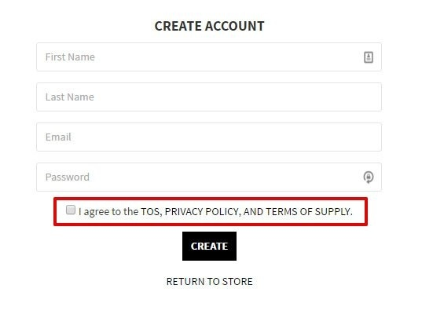

Thông thường khi làm chức năng đăng kí tham gia một dịch vụ nào đó thường bắt gặp một ô checkbox yêu cầu chấp nhận Điều khoản dịch vụ / Chính sách bảo mật(Terms of Service/Privacy Policies). Trong trường hợp này chúng ta thường có một attribute trong database để xác nhận người dùng đã đồng ý hay chưa.

Trong quá khứ, những thứ như vậy thường không được lưu trữ trong database - nó thường được validate ở frontend or thêm một thuộc tính ảo(virtual attribute) ở backend để validate.

Bài viết này sẽ tập trung vào trường hợp thứ hai, chúng ta sẽ thực hiện các giải pháp mà không cần lưu dữ liệu trên DB.

## Anatomy Of The Problem

User khi trước khi submit đăng kí phải bắt buộc đồng ý với Điều khoản dịch vụ(Terms of Service) của nhà cung cấp. Ngoài việc validate trên UI cần đảm bảo cũng được validate ở phía backend.



## Solution 1 – Thêm 1 attribute ảo vào model và validate nó

Đây có lẽ là cách tiếp cận đơn giản nhất cho vấn đề trên. Dưới đây là cách chúng ta có thể triển khai:

```ruby
# app/models/user.rb
class User < ApplicationRecord
  attr_accessor :terms_of_service_accepted

  validates :terms_of_service_accepted, acceptance: true
end
```

Điều này chắc chắn sẽ hoạt đông. Nhưng hiện tại, việc xác thực sẽ luôn được thực hiện, ngay cả khi update, nó sẽ không có ý nghĩa gì nhiều. Chúng ta cần tìm một giải pháp tốt hơn.

## Solution 2 - Thêm 1 attribute ảo vào model và chỉ validate nó khi create

Một cải tiến nhỏ so với giải pháp trước là chúng ta đảm bảo rằng việc xác thực chỉ được gọi đến khi create:

```ruby
# app/models/user.rb
class User < ApplicationRecord
  attr_accessor :terms_of_service_accepted

  validates :terms_of_service_accepted, acceptance: true, on: :create
end
```

Ngay cả khi đã giải quyết được vấn đề thực tế nhưng có một vấn đề lớn về điều đó là việc validate sẽ luôn được kích hoạt trong quá trình tạo, ngay cả khi tạo người dùng từ factories! Vậy chúng ta có những lựa chọn nào khác?

## Solution 3 - Thêm 1 attribute ảo vào model và chỉ validate nó trong 1 trường hợp cụ thể

Điều thú vị trong ActiveModel validations là option `on` sẽ không giới hạn việc `:create` hay `:update` context - đó chỉ là những cái mà ActiveRecord đặt theo mặc định tùy thuộc vào trạng thái của model. Chúng ta có thể cung cấp các tuỳ chỉnh cho cả 2 method `valid?` và `save`

```ruby
user.valid?(:registration)
user.save(context: :registration)
```

Trong trường hợp đó, chúng ta có thể thay thế `:create` với `:registration` để validate.

```ruby
# app/models/user.rb
class User < ApplicationRecord
  attr_accessor :terms_of_service_accepted

  validates :terms_of_service_accepted, acceptance: true, on: :registration
end
```

Tuy nhiên, điều này vẫn không lý tưởng - một model được sử dụng trong nhiều context khác nhau có một số logic chỉ áp dụng cho một trường hợp sử dụng và thậm chí còn tệ hơn, đó là mối quan tâm về UI.

## Solution 4 - Dùng form object

Sử dụng form object có lẽ là giải pháp tốt nhât cho vấn đề trên. Có nhiều cách để implement một form object:

- Tạo một ActiveModel model khác và tận dụng lợi thế của [ActiveModel Attributes](https://github.com/Azdaroth/active_model_attributes).
- Dùng gem [dry-validation](http://dry-rb.org/gems/dry-validation/basics/working-with-schemas/)
- Dùng gem [reform](https://github.com/trailblazer/reform) từ [Trailblazer](http://trailblazer.to/) slack.

Trong bài viết này ta sẽ dùng gem [reform](https://github.com/trailblazer/reform) cho ví dụ trên

```ruby
# app/forms/user/registration_form.rb
require "reform/form/coercion"

class User::RegistrationForm < Reform::Form
  # other property declarations and validations

  property :terms_of_service_accepted, virtual: :true, type: Types::Form::Boolean

  validates :terms_of_service_accepted, acceptance: true
end
```

Đoạn code trên ngoài việc xử lí các properties(`email`, `password`, `password_confirmation`) ta còn tạo một attribute `terms_of_service_accepted` ảo(virtual) có type là `boolean` và thêm validate cho attribute trên.

Mặc dù dùng form object là cách tiếp cận rõ ràng nhất tuy nhiên nó yêu cầu một số chi phi bổ sung, hầu hết cho việc setup, đôi khi có thể gây thêm khó khăn khi thêm setup or áp dụng logic từ bên thứ 3, ví dụ như [devise_invitable](https://github.com/scambra/devise_invitable).
